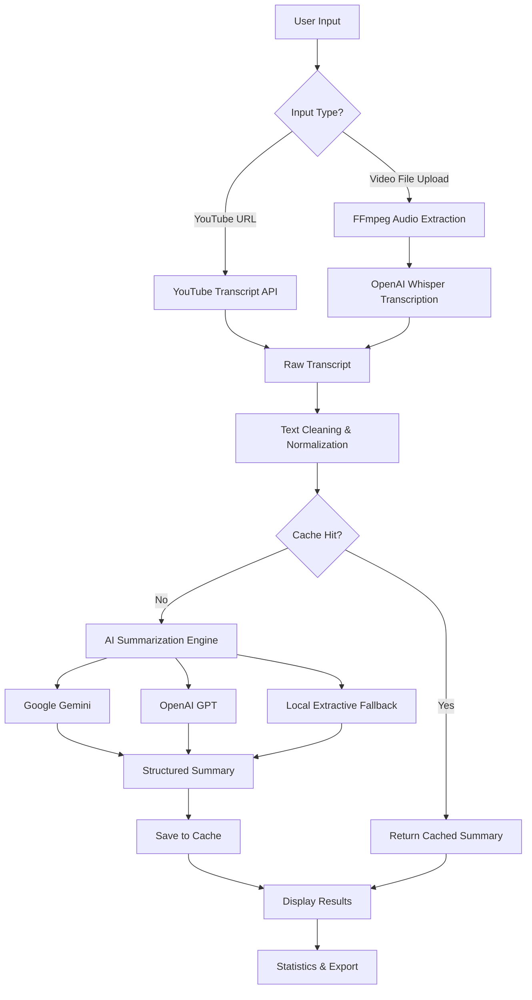

# Video Summarizer Pro

> Transform any video into concise, actionable insights using AI-powered transcription and summarization.

[](https://python.org)
[](https://streamlit.io)
[](LICENSE)

---

## Table of Contents

- [Overview](#overview)
- [Architecture & Flow](#architecture--flow)
- [Features](#features)
- [System Requirements](#system-requirements)
- [Installation](#installation)
- [Configuration](#configuration)
- [Usage](#usage)
  - [Streamlit Web Application](#streamlit-web-application)
  - [Command-Line Interface](#command-line-interface)
- [Project Structure](#project-structure)
- [Process Flow](#process-flow)
- [API Reference](#api-reference)
- [Performance Considerations](#performance-considerations)
- [Troubleshooting](#troubleshooting)
- [License](#license)

---

## Overview

**Video Summarizer Pro** is a production-ready Python application that automatically extracts transcripts from YouTube videos and uploaded video files, then generates intelligent summaries using state-of-the-art Large Language Models (LLMs).

The system supports dual interfaces:
- **Streamlit Web App** — Interactive, browser-based UI with real-time progress tracking
- **CLI Tool** — Lightweight terminal interface for batch processing and automation

---

## Architecture & Flow



### Component Breakdown

| Layer | Component | Responsibility |
|-------|-----------|---------------|
| **Interface** | `app.py` / `main.py` | User input collection, result presentation |
| **Ingestion** | `modules/youtube.py` | URL parsing, transcript extraction via YouTube Transcript API |
| **Processing** | `modules/file_processor.py` | Audio extraction (FFmpeg), speech-to-text (Whisper) |
| **Transformation** | `modules/utils.py` | Text normalization, artifact removal, caching |
| **Intelligence** | `modules/summarizer.py` | LLM abstraction, prompt engineering, multi-provider support |
| **Persistence** | `cache/summaries.json` | 7-day LRU cache for duplicate request avoidance |

---

## Features

### Core Capabilities
- **YouTube Integration** — Extract transcripts from any public YouTube video with captions enabled
- **Large File Support** — Process video uploads up to **10GB** with chunked I/O and disk-space validation
- **Multi-Model AI** — Choose between Google Gemini (recommended), OpenAI GPT, or offline local summarization
- **Intelligent Caching** — Automatic deduplication with 7-day TTL cache
- **Progress Tracking** — Real-time status updates during long-running operations
- **Auto-Cleanup** — Temporary files removed immediately after processing

### Quality-of-Life Features
- Configurable summary length (100–500 words)
- Whisper model selection (tiny → large) for accuracy vs. speed trade-offs
- Session statistics dashboard
- One-click cache clearing
- Export summary as `.txt` file
- Responsive, gradient-styled Streamlit UI

---

## System Requirements

| Requirement | Minimum | Recommended |
|-------------|---------|-------------|
| Python | 3.10 | 3.11+ |
| RAM | 4 GB | 8 GB+ |
| Disk Space | 2× video size | 3× video size |
| FFmpeg | Required | Latest stable |
| GPU | Optional | CUDA-capable for Whisper |

### Platform Support
- macOS (primary development platform)
- Linux
- Windows (with WSL recommended)

---

## Installation

### 1. Clone the Repository
```bash
git clone https://github.com/gulkhan92/youtube-Video-summarizer.git
cd youtube-Video-summarizer
```

### 2. Create Virtual Environment
```bash
python3 -m venv venv
source venv/bin/activate  # macOS/Linux
# venv\Scripts\activate   # Windows
```

### 3. Install Dependencies
```bash
pip install -r requirements.txt
```

### 4. Install FFmpeg
```bash
# macOS
brew install ffmpeg

# Ubuntu/Debian
sudo apt update && sudo apt install ffmpeg

# Windows (via chocolatey)
choco install ffmpeg
```

### 5. Configure API Keys
Create a `.env` file in the project root:
```env
GOOGLE_API_KEY=your_google_generative_ai_key_here
OPENAI_API_KEY=your_openai_key_here  # Optional
```

> **Security Note:** The `.env` file is excluded from version control via `.gitignore`. Never commit API keys.

---

## Configuration

### Environment Variables

| Variable | Required For | Description |
|----------|-------------|-------------|
| `GOOGLE_API_KEY` | Gemini summarizer | Google Generative AI API key |
| `OPENAI_API_KEY` | OpenAI summarizer | OpenAI API key |

### Whisper Model Sizes

| Model | Parameters | Speed | Accuracy | VRAM |
|-------|-----------|-------|----------|------|
| `tiny` | 39 M | Fastest | Basic | ~1 GB |
| `base` | 74 M | Fast | Good | ~1 GB |
| `small` | 244 M | Moderate | Better | ~2 GB |
| `medium` | 769 M | Slow | High | ~5 GB |
| `large` | 1550 M | Slowest | Best | ~10 GB |

---

## Usage

### Streamlit Web Application

Launch the interactive web UI:
```bash
streamlit run app.py
```

The application will be available at `http://localhost:8501`.

#### Workflow
1. **Select Input Method** — Choose between the *YouTube URL* tab or the *Upload Video* tab
2. **Configure Settings** — Adjust model, transcription quality, and summary length in the sidebar
3. **Submit** — Click the summarize button and monitor real-time progress
4. **Review Results** — View the AI-generated summary, compression ratio, and reading-time estimate
5. **Export** — Download the summary as a text file or copy to clipboard

### Command-Line Interface

Process video files directly from the terminal:
```bash
python3 main.py <video_file> [options]
```

#### Examples
```bash
# Basic usage
python3 main.py recording.mp4

# Custom output prefix
python3 main.py recording.mp4 -o meeting_notes

# Higher quality transcription
python3 main.py lecture.mp4 --whisper large -l 500
```

#### CLI Options
| Option | Description | Default |
|--------|-------------|---------|
| `video_file` | Path to input video | Prompted if omitted |
| `-o, --output` | Output file base name | Input filename stem |
| `-l, --length` | Maximum summary word count | 300 |
| `--whisper` | Whisper model size | `medium` |

#### Output Files
Two text files are generated in the working directory:
- `{output}_transcript.txt` — Full raw and cleaned transcripts
- `{output}_summary.txt` — AI-generated summary with metadata

---

## Project Structure

```
youtube-Video-summarizer/
├── app.py                     # Streamlit web application entry point
├── main.py                    # CLI tool entry point
├── requirements.txt           # Python dependencies
├── .gitignore                 # Version control exclusions
├── README.md                  # Project documentation
├── cache/                     # Persistent summary cache directory
│   └── summaries.json
├── modules/
│   ├── __init__.py
│   ├── youtube.py             # YouTube transcript fetching
│   ├── file_processor.py      # Audio extraction & Whisper transcription
│   ├── summarizer.py          # LLM abstraction layer
│   └── utils.py               # Caching, cleaning, helpers
└── .env                       # API keys (not tracked by git)
```

---

## Process Flow

### YouTube Video Pipeline

1. **URL Validation** — The user provides a YouTube URL. The system validates the format and extracts the video ID using regex patterns that support standard, short, embed, and Shorts URLs.

2. **Transcript Retrieval** — The `youtube_transcript_api` library fetches caption data in the requested language (default: English). If captions are disabled or unavailable, a clear error message guides the user to try file upload instead.

3. **Text Cleaning** — Raw transcripts often contain artifacts like `[Music]`, `(inaudible)`, extra whitespace, and punctuation errors. The cleaning module normalizes spacing, removes bracketed annotations, and capitalizes sentences.

4. **Cache Lookup** — A SHA-256 hash of the video URL and selected model is checked against the local cache. If a recent summary exists, it is returned instantly, saving API costs and processing time.

5. **AI Summarization** — The cleaned transcript is sent to the selected LLM with a structured prompt requesting bullet-point summaries within the word-count constraints.

6. **Result Presentation** — The summary is displayed alongside metrics: word count, reading time, compression ratio, and model used. The result is saved to cache for future requests.

### File Upload Pipeline

1. **Chunked Upload** — Large video files are read in 1 MB chunks to prevent memory exhaustion. Files up to 10 GB are supported.

2. **Disk Validation** — Before processing, the system verifies that at least 2× the video size is available as free disk space for audio extraction and temp files.

3. **Audio Extraction** — FFmpeg extracts the audio track to a temporary MP3 file (mono, 16 kHz) optimized for Whisper transcription.

4. **Speech-to-Text** — OpenAI Whisper transcribes the audio. Model size is user-configurable to balance speed and accuracy.

5. **Post-Processing** — The transcript undergoes the same cleaning, caching, and summarization pipeline as YouTube videos.

6. **Cleanup** — Temporary audio files are deleted immediately after transcription, regardless of success or failure.

---

## API Reference

### `modules.youtube`

```python
from modules.youtube import fetch_youtube_transcript

transcript = fetch_youtube_transcript(
    url="https://www.youtube.com/watch?v=...",
    languages=["en"]
)
```

### `modules.file_processor`

```python
from modules.file_processor import process_uploaded_file

transcript = process_uploaded_file(
    video_path="/path/to/video.mp4",
    whisper_model_size="base",
    progress_callback=lambda msg, pct: print(f"{pct}%: {msg}")
)
```

### `modules.summarizer`

```python
from modules.summarizer import summarize_text

summary = summarize_text(
    transcript=cleaned_text,
    model="gemini",       # or "openai", "local"
    max_length=300
)
```

---

## Performance Considerations

| Bottleneck | Mitigation Strategy |
|-----------|---------------------|
| Large video uploads | Chunked 1 MB I/O, disk-space pre-check |
| Whisper transcription | Configurable model size (tiny → large) |
| LLM API latency | 7-day cache with automatic expiration |
| Memory pressure | FFmpeg subprocess extraction (not in-memory) |
| Disk bloat | Automatic temp-file cleanup in `finally` blocks |

